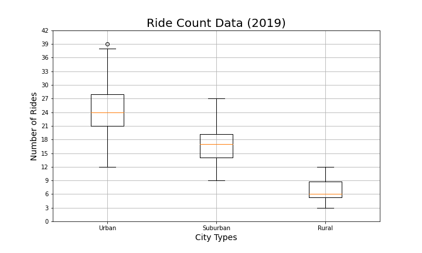
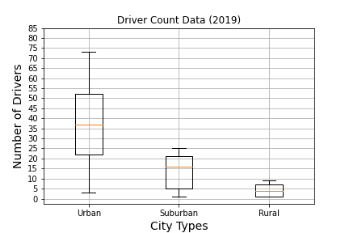
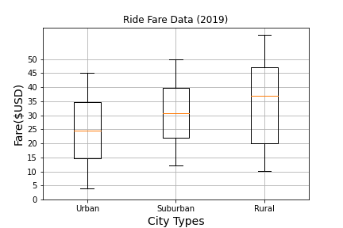
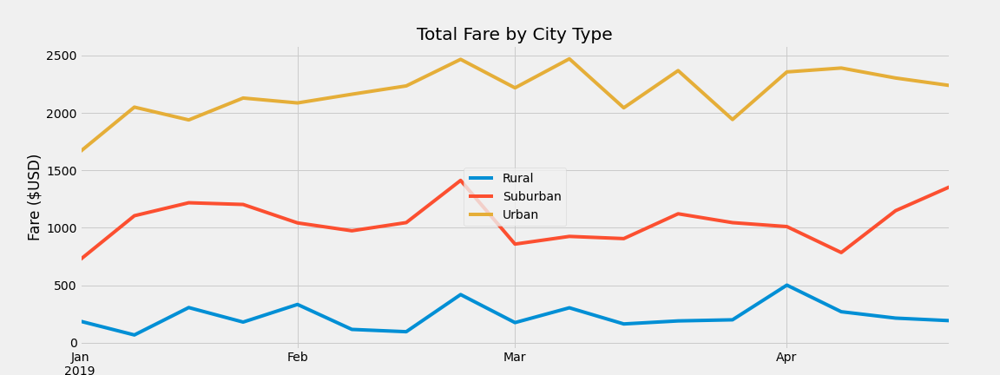

# PyBer_Analysis
## Overview of the analysis:
The purpose of this challenge is to perform an exploratory analysis on of Pyber ride sharing data and create several visualizations to generate a compelling story that can describe the data and the relationship between the type of city, the number of drivers and the number of rides and the percentage of total fares by type of city and help PyBer improve their acess to ride-sharing services and determine the affordability for underderved neighborhoods.

## Resources
* Data Source: PyBer_ride_data.csv, city_data.csv, ride_data.csv
* Software: Python 3.9.5, Jupyter Notebook 6.3.0

## Results:

After performin an analysis of each city type, a summary dataframe was created, this dataframe describe the differences in total drivers, total fares, the average fare per driver and the average fare per ride as shown in the image below.

With this table we can see that there is a much bigger number of total rides, total drivers and as well of the total fares collected in the Urban type of cities than in the Suburban and Rural ones, however, the average fare per ride and average fare per driver is a lot more in the Rural cities. There is also a bigger rides to driver ratio in Rural zones (1.602 rides/driver) which could explain their elevated prices per ride, in comparisson, the Urban cities have a rides to driver ratio smaller than one (0.675 rides/driver), indicating that there are more drivers than rides. 
In the boxplots below, we can other comparissons between the type of cities:

### Rides per City Type

  

### Drivers per City Type

  

### Fares per City Type

  

By reviewing the summary and the previous graphs we can observe several key findings:
* Total Rides:
  *   *Urban* cities rides are **13 times** *Rural* cities rides.
  *   *Suburban* cities rides are **5 times** *Rural* cities rides.
* Total Drivers:
  *   The total drivers of *Urban* cities is **9.2 times** the total number of drivers in *Rural* cities.
  *   The total number of drivers in *Suburban* cities is **6.28 times** the total drivers of *Rural* cities.
* Total Fares:
  *   The total fares of *Urban* cities is almost **31(30.83) times** the total fares in *Rural* cities.
  *   The total collected fares of drivers in *Suburban* cities is almost **4.5(4.47) times** the total collected fares in *Rural* cities.
* Average Fare per Ride:
  *   The average fare per ride of *Rural* cities is a little more than **10(10.09) USD** more than the average fare in *Urban* cities.
  *   The  average fare per ride of *Rural* cities is **3.65 USD** more than the one in *Suburban* cities.
 * Average Fare per Driver:
  *   The average fare per ride of *Rural* cities is **3.34 times** more than the average fare per driver in *Urban* cities.
  *   The  average fare per ride of *Rural* cities is almost **16(15.99) USD** more than the one in *Suburban* cities.

In addition, a multine chart was created in order to visualize better the trend ob collected fares per month by PyBer in 2019, as we can see in the image below:

  

## Summary:

Base on the data analysed and in the visualizations created, i could give the next recommendations:
* There is a very high rides to driver ratio in *Urban* cities, which is probably causing a decrease in the fare per ride price by the supply and demand law, so it will be better to redistribute their drivers in different city types to regulated the fare.
* The average fare per ride and average fare per driver in *Rural* cities is much higher than in the other types, which could mean that the drivers are taking longer trips and that there is a smaller supply than the demand of rides, that increases the prices and discourages possible clients, so a redistribution of drivers or a cap fare should be considered to make a ride in this zones more affordable.
* Decrease the number of drivers in "Urban" cities and increase the average fare per driver as a result of having an equilibrium in the supply-demand law.
